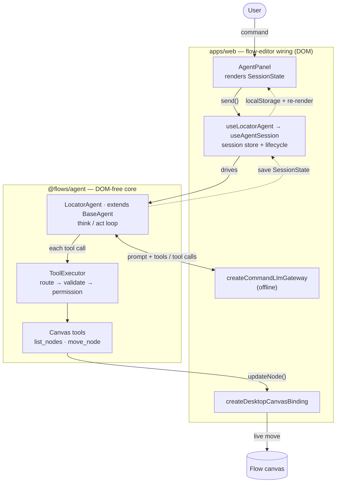

# Locator agent

> **The first shipped agent.** It **moves one existing node** by chat — "nudge the fetch node 10px to
> the right," "move _Summarize_ up 40px," "put the email node at x=200, y=120." The move is applied
> straight to the live canvas. It builds on the [shared agent architecture](../../design/architecture.md)
> and this page covers only what the locator adds; the shared model is not restated here.

## 1. What it is

A chat agent in the flow editor whose one job is **relocation**. You describe where an existing node
should go — relative ("right 10px", "up a bit") or absolute ("to x=200, y=120") — and the agent finds
that node and moves it. Position is a frontend-only property (§6), so a move is a single, synchronous
canvas edit with no server write.

Moving a node by chat goes through the agent: it applies each move live through the single `CanvasBinding`
seam — one writer alongside direct drags, and (like a drag) its move lands on the canvas undo stack.

One turn: you send a message → the agent reads the flow to identify the target and compute its new
position → it calls **`move_node`**, applied immediately via the `CanvasBinding` → it replies with a
one-line confirmation (or, if it couldn't resolve the request, asks / reports).

## 2. Principles

1. **Live, consistent reads.** The agent re-reads the live canvas (the store) each turn and applies moves
   synchronously, so the graph it reasons over always reflects its own prior moves in the turn.
2. **Direct apply.** A `move_node` call takes effect on the live canvas at once.
3. **Existing nodes only.** The agent only changes a node's `position`; it never creates, deletes,
   connects, or reconfigures. Anything else, it declines.
4. **One node per move call.** A request that names several nodes becomes several `move_node` calls in
   the same turn; each call moves exactly one node.
5. **Frontend-only.** A move is `CanvasBinding.updateNode(id, { position })` — no direct backend write. It
   takes the same path as a user edit: checkpointed for undo, and persisted only when autosave is enabled.
6. **Resolve or ask — never guess.** If the target is ambiguous (multiple matches) or missing (no
   match), the agent asks or reports, and moves nothing.

## 3. Scope

- **In:** move one existing node by a **relative delta** (direction + pixels) or to an **absolute
  point**; reference the node by its label/name or block type; move several nodes in one turn (one call
  each); confirm what it did.
- **Not in scope:** adding / deleting / reconfiguring / connecting nodes; multi-node relational layout
  ("align these", "space them evenly"). If the user asks for one, the agent declines. (Its own moves are
  undoable — they land on the canvas undo stack — but the agent exposes no undo command.)
- **Coordinates.** Origin top-left, `x` increases **right**, `y` increases **down** (§5.1) — the
  existing canvas convention (`NodeData.position`).

## 4. What it adds to the shared model

Only two things sit on top of the [shared architecture](../../design/architecture.md); everything else
(the Agent turn loop, `ToolExecutor`, permissions, Session/`SessionStore`) is inherited unchanged:

- **A canvas tool provider** (`list_nodes` + `move_node`) and the locator persona, bundled as its
  `AgentConfig`. In the editor its `grant` is derived from the flow's live `FlowPermissions` (`toAgentGrant`),
  so `move_node` (which requires `canModifyCanvas`) is denied for a viewer (§5.2).
- **Per-turn node-list seeding** — before each model call the agent injects the current node list
  (id / type / label / position) so the model can match a name/type to an id and read current positions.

The locator uses the base `AgentPhase` (`idle | thinking | done | error`); a `move_node` result _is_ the
applied change.

```ts
// The move tool's input — exactly one of `by` (relative) or `to` (absolute).
interface MoveNodeArgs {
    nodeId: string; // resolved id of the node to move (§5.1)
    by?: { dx: number; dy: number }; // relative delta in px, canvas coords
    to?: XY; // absolute destination in px
}

// list_nodes projection — just enough for the model to pick a target and do math.
interface NodeLocation {
    id: string;
    type: string; // block/process type
    label?: string; // the node's customLabel if set; otherwise omitted (the model falls back to type)
    position: XY;
}
```

## 5. Detailed behavior

### 5.1 The turn & move semantics

The turn is the [shared think/act loop](../../design/architecture.md#the-turn-thinkact-loop), seeded
each iteration with the live node list and finishing on the confirmation text. Moves applied before an
`abort()` stay applied.

- **Target resolution.** The model matches the user's reference (a label like _Summarize_, or a type
  like "the http node") against `list_nodes`, case-insensitive. Only a node's **`customLabel`** is
  surfaced as its label; a node that was never relabeled is matched on its **`type`**.
    - **No match** → the agent reports it can't find that node; nothing moves.
    - **Multiple matches** → the agent asks which one (lists the candidates); nothing moves.
- **Relative (`by`).** Direction → sign, in canvas coords: **right** `dx = +n`, **left** `dx = −n`,
  **up** `dy = −n`, **down** `dy = +n`. Diagonals combine (e.g. "up-right 10" → `dx = +10, dy = −10`).
  With no number given ("nudge it right"), a default step of **20px** is used and said so.
- **Absolute (`to`).** New position = `to` verbatim.
- **`move_node`** validates that exactly one of `by` / `to` is present and that `nodeId` exists, computes
  the final `XY`, rejects a non-finite result, then calls `binding.updateNode(nodeId, { position })`.
  Positions may go negative — no clamping.

### 5.2 Tools

| Tool         | Kind   | Target      | Notes                                                                        |
| ------------ | ------ | ----------- | ---------------------------------------------------------------------------- |
| `list_nodes` | read   | live canvas | `binding.readGraph()` → `NodeLocation[]`; the palette of movable targets     |
| `move_node`  | mutate | live canvas | `MoveNodeArgs`; resolves final `XY` → `binding.updateNode(id, { position })` |

Both live in **one canvas tool provider**, split by domain rather than by read/mutate. Read vs. mutate
is the per-tool `requires` the executor checks: `list_nodes` needs no capability, `move_node` requires
`canModifyCanvas`.

### 5.3 UI / layout

The **Agent Panel is docked on the right** whenever a flow is open (it mounts once the flow has an id) —
there is no open/close toggle. The canvas occupies the remaining width to its left (a fixed-width docked column, not
an overlay). Opening a flow rehydrates its persisted session, so the conversation is there too.

## 6. Grounding (what already exists)

The move rides on primitives already in the repo — no new backend work. See the
[shared grounding table](../../design/architecture.md#grounding-what-already-exists) for the Agent /
LLM / tools / permissions seams; the locator-specific ones:

| Seam                | Wraps                                                                         | Where                                                   |
| ------------------- | ----------------------------------------------------------------------------- | ------------------------------------------------------- |
| `list_nodes` (read) | `CanvasBinding.readGraph()`, projected to `NodeLocation[]`                    | `apps/web/.../utils/createDesktopCanvasBinding.ts`      |
| `move_node` (apply) | `CanvasBinding.updateNode(id, { position })` → `WorkflowCanvasRef.updateNode` | same file; `apps/web/.../components/WorkflowCanvas.tsx` |
| node shape          | `NodeData` — `id`, `type`, `position`, `customLabel`                          | `@lemoncloud/eureka-flows-api`                          |

## 7. What shipped

Two pieces: **`libs/agent` (`@flows/agent`)**, a DOM-free, node-testable agent core; and the
**flow-editor wiring (`apps/web`)** — an always-present, right-docked chat panel that shrinks the canvas.



The app implements the lib's two seams — `LlmGateway` (the offline command gateway) and `CanvasBinding`
(the desktop binding); the turn loop itself never touches the DOM.

### Tests

Lib specs live in `libs/agent/src/__tests__/` (vitest env `node`); the app's agent specs in
`apps/web/src/__tests__/agents/` (jsdom).

- **Move math & validation** — `moveSemantics` (direction→delta, relative/absolute, the 20px default)
  and the JSON-Schema arg validator.
- **Executor & tools** — routing, arg validation, permission checks and denial, error wrapping; the
  canvas tools' `list_nodes` / `move_node` behavior including non-finite and missing-node rejection.
- **The full turn** — both user stories (§8) plus absolute and vague moves, an ambiguous reference,
  multi-node turns, `abort`, the iteration cap, and a gateway error.
- **App wiring** — `AgentPanel` end-to-end with a fake gateway and with the offline command gateway;
  `useLocatorAgent` lifecycle (abort on flow switch and on unmount, StrictMode re-arm, localStorage
  persist/rehydrate, stale-`thinking` sanitize on reload); and `createCommandLlmGateway` driven through
  the full agent → executor → canvas pipeline.

## 8. User stories

**Story 1 — relative nudge (the headline).** Given a node labeled _Fetch_ at `(200, 80)`, when I send
_"move the Fetch node 10px to the right,"_ the agent calls
`move_node({ nodeId: <fetch>, by: { dx: 10, dy: 0 } })`, the node becomes `(210, 80)` on the live
canvas, the agent confirms, and no other node moves.

**Story 2 — target not found.** Given no node matching _Translate_, when I send _"move the Translate
node up 30px,"_ the agent moves nothing and replies that it couldn't find a _Translate_ node.
