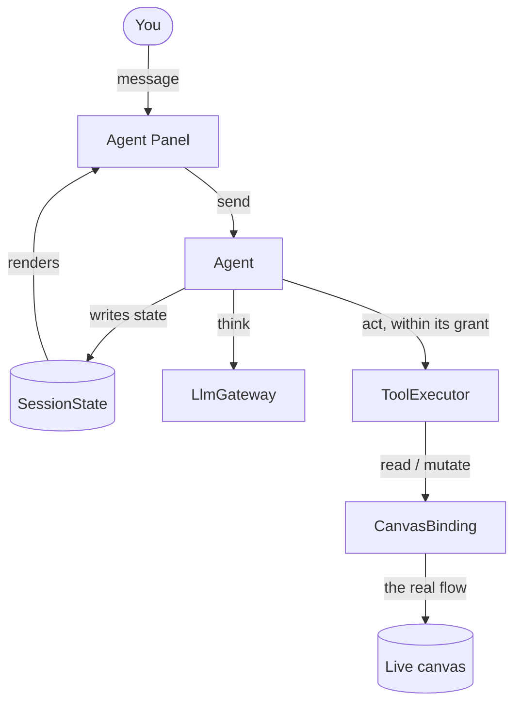
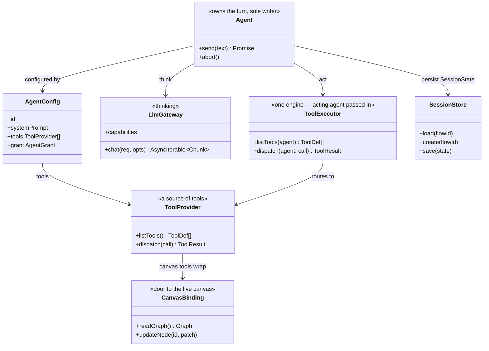
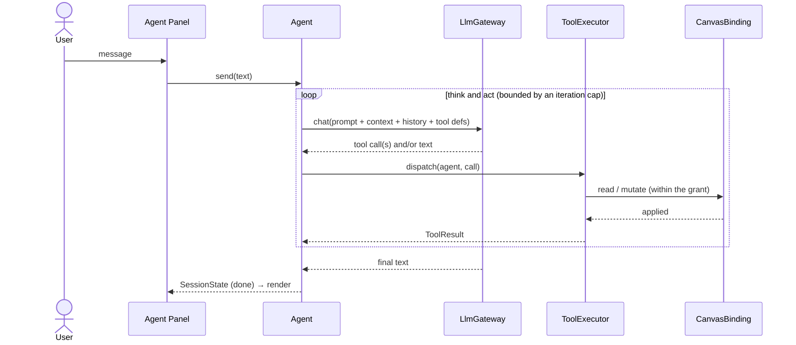

# Agent architecture — the shared model

The parts every in-browser flow agent is built from, described once. The concrete
[locator agent](../agents/locator/SPEC.md) references this page instead of restating it; its own doc
covers only what it _adds_.

The DOM-free core is `@flows/agent` (`libs/agent`); the editor wiring lives in
`apps/web/src/app/features/flows/`.

## At a glance

You talk to the **Panel**; one **Agent** owns the turn and is the only writer. It runs a think/act
loop — ask the **LlmGateway**, run tool calls through the one **ToolExecutor** (which checks
permissions), repeat until the model is done — and reaches the live canvas through a single seam, the
**CanvasBinding**. The persisted **SessionState** is what the Panel renders from.

```
Panel → Agent → LlmGateway (think)
              → ToolExecutor → tools → CanvasBinding → live canvas (act)
              → SessionState → Panel (render)
```



The little loop on the left — **Panel → Agent → store → Panel** — is one-way. The Panel only sends
commands and renders what's in the store; it never touches the flow itself.

## Principles

- **One agent owns the turn, and is the only writer.** "Agent" means a single capability (a persona +
  its tools + its permissions), not a coordinator of sub-agents. The Panel talks straight to the agent.
- **Permissions live on the agent, not globally.** Every mutate tool declares the capability it needs;
  the executor checks it against the agent's grant before running. An agent can never do more than its
  grant allows.
- **One seam to the canvas.** All reads and writes of the live flow go through the `CanvasBinding`; the
  turn loop itself never touches the DOM.

## Components

| Component         | Role                                                                                                                |
| ----------------- | ------------------------------------------------------------------------------------------------------------------- |
| **Agent Panel**   | Chat UI. Emits `send`; renders purely from the session store. No logic.                                             |
| **Agent**         | Owns the turn and is the only writer: runs the think/act loop. Configured with a persona + tools + a grant.         |
| **LlmGateway**    | The one outbound LLM dependency, behind one interface so it can be swapped (offline command gateway, fake, Gemini). |
| **ToolExecutor**  | One engine for the session: route a call by name → validate args → check the agent's grant → dispatch → result.     |
| **CanvasBinding** | The single seam to the real, React-owned canvas: read it, edit a node.                                              |
| **SessionStore**  | Loads/creates/saves the `SessionState` the Panel renders from, keyed by `flowId`.                                   |

### The pieces (UML)



## The turn (think/act loop)

The generic loop is written once, in `BaseAgent` (`libs/agent/src/agents/baseAgent.ts`); a concrete
agent supplies only its `AgentConfig` and, optionally, per-turn context messages recomputed each
iteration.



Not shown in the diagram: the turn moves through phases `idle → thinking → done`, ending in `error` on a
gateway failure or on exceeding the iteration cap. `abort()` cancels the in-flight gateway stream, but
work already applied stays applied; and a `send` arriving while a turn is in flight is ignored — a single
active turn.

## Interfaces

The provider-neutral contracts as they ship in `@flows/agent`.

```ts
// ── Agent — owns the turn, sole writer ───────────────────────────────────────
interface Agent {
    send(text: string): Promise<void>; // append user msg → run the whole turn
    abort(): void; // cancel the in-flight stream; applied work stays applied
}
// What varies between capabilities.
interface AgentConfig {
    id: string;
    description: string; // what it handles
    systemPrompt: string; // persona / instructions
    tools: ToolProvider[]; // its tool sources; the executor unions + routes across them
    grant: AgentGrant; // the capabilities it is allowed to use
}

// ── Permissions ──────────────────────────────────────────────────────────────
type Capability = 'canModifyCanvas' | 'canEditConfig' | 'canEditStructure' | 'canRun'; // compile-guarded subset of keyof FlowPermissions
type AgentGrant = Partial<Record<Capability, boolean>>; // absent/false = denied; derived from the flow's FlowPermissions via toAgentGrant()

// ── LlmGateway — the one outbound LLM dependency ─────────────────────────────
interface LlmGateway {
    readonly capabilities?: LlmGatewayCapabilities; // absent = unspecified (don't assume tool support)
    chat(req: ChatRequest, opts?: { signal?: AbortSignal }): AsyncIterable<Chunk>;
}
interface LlmGatewayCapabilities {
    readonly toolCalls: boolean;
}
interface ChatRequest {
    messages: ChatMessage[];
    tools: ToolDef[];
    stream?: boolean;
}
interface ChatMessage {
    role: 'system' | 'user' | 'assistant' | 'tool';
    content: string | null;
    toolCalls?: { id: string; name: string; args: string }[]; // args = the raw JSON string
    toolCallId?: string;
}
interface ToolDef {
    name: string;
    description: string;
    parameters: JsonSchema;
    requires?: Capability; // the capability this tool needs; reads omit it
}
interface Chunk {
    text?: string;
    toolCall?: { id: string; name: string; argsDelta: string };
    done?: boolean;
    usage?: { inputTokens?: number; outputTokens?: number }; // emitted with the final chunk when reported
}

// ── ToolExecutor & tools ─────────────────────────────────────────────────────
interface ToolCall {
    id: string;
    name: string;
    args: unknown; // already parsed from the model's raw JSON
}
type ToolResult = { toolCallId: string; ok: true; data?: unknown } | { toolCallId: string; ok: false; error: string };

// A ToolProvider is one source of tools — it lists them and runs them. Maps 1:1
// to an MCP server (listTools ↔ tools/list, dispatch ↔ tools/call).
interface ToolProvider {
    listTools(): ToolDef[] | Promise<ToolDef[]>;
    dispatch(call: ToolCall): ToolResult | Promise<ToolResult>;
}
// ONE executor for the session — a single engine, not reimplemented per agent.
// The acting agent (its tools + grant) is passed in each call.
interface ToolExecutor {
    listTools(agent: AgentConfig): Promise<ToolDef[]>; // the agent's providers' tools, unioned
    dispatch(agent: AgentConfig, call: ToolCall): Promise<ToolResult>; // route by name → validate → check grant → run
}

// ── CanvasBinding — the one door to the live canvas ──────────────────────────
type Graph = { nodes: NodeData[]; edges: EdgeData[] }; // the live canvas shape, normalized
interface CanvasBinding {
    readGraph(): Graph; // live structural read
    updateNode(id: string, patch: { label?: string; position?: XY }): void; // one node, immediate, frontend-only
}

// ── Session — what the Panel renders from ────────────────────────────────────
type AgentPhase = 'idle' | 'thinking' | 'done' | 'error';
interface SessionState {
    flowId: string;
    messages: Message[];
    phase: AgentPhase;
    error?: string; // set when phase === 'error'
}
interface SessionStore {
    load(flowId: string): SessionState | null;
    create(flowId: string): SessionState;
    save(state: SessionState): void;
}
```

## ToolExecutor & permissions

There is **one `ToolExecutor` for the session** — a single engine, not subclassed per agent. The acting
agent is passed in (`dispatch(agent, call)`), and the executor reads that agent's `tools` (to route) and
`grant` (to gate). Per-agent behavior is therefore _data the same code reads_, not new code.

`dispatch(agent, call)` is the single choke-point per tool call: **route by name** → **validate** `args`
against the tool's JSON Schema → **check permission** → return a `ToolResult`. It never throws; a denied
or invalid call returns `{ ok: false, error }` and changes nothing.

Tools come from **providers**, and an agent can compose several — its `tools` is a list. Each provider
lists and runs its own tools; the executor unions their `listTools()` for the model and builds a
`name → provider` index so `dispatch` routes each call. A provider holds no agent-specific state, so one
provider can back several agents; each agent's `grant` decides what it may actually call.

**Permission is per-tool, per-agent.** Each tool declares the capability it needs via `ToolDef.requires`
(reads omit it). A call is allowed only if that capability is enabled in the agent's `grant`. So the
same tool can be callable for one agent and denied for another.

## CanvasBinding — the seam

The single door between the (non-React) agent core and the React-owned live canvas, injected at mount.
On desktop the canvas is store-sourced (`useCanvasStore`), so `readGraph` reads the store directly, while
writes go through the `WorkflowCanvas` ref — which checkpoints for undo and guards on `canModifyCanvas`.

- `readGraph()` — the live `{ nodes, edges }`.
- `updateNode(id, patch)` — one node's label / position, frontend-only; on desktop it is guarded on
  `canModifyCanvas` and checkpointed, so the move is undoable like a user drag.

The desktop implementation and the primitives it wraps are in [canvas-binding.md](canvas-binding.md).

## Session & storage

`SessionState` is the whole persisted turn state; the Panel is a pure function of it. `SessionStore`
loads/creates a session keyed by `flowId` and `save`s at each turn step — after the user message, after
the fully-collected assistant reply, after each tool result, and on phase transitions. The gateway
stream is drained in full before the reply is persisted; text is not saved token-by-token. The render
loop is one-way: Panel emits commands → the Agent writes `SessionState` → store → Panel re-renders.

`@flows/agent` ships an in-memory `SessionStore` via `createInMemorySessionStore` (the default for tests
and Node runs); in the browser, `useAgentSession` builds a `SessionStore` whose writes and hydration
persist through the Agent Environment's storage port (localStorage), so a transcript survives a reload.

## Grounding (what already exists)

Every seam wraps a primitive already in the repo, which is what makes an agent implementable without new
backend work.

| Seam               | Wraps                                                                                                                                                           | Where                                              |
| ------------------ | --------------------------------------------------------------------------------------------------------------------------------------------------------------- | -------------------------------------------------- |
| `readGraph` (live) | `useCanvasStore.getState()` → `{ nodes, edges: connections }` (reads the store directly; `getWorkflow` lags within a turn)                                      | `apps/web/.../utils/createDesktopCanvasBinding.ts` |
| `updateNode`       | `WorkflowCanvasRef.updateNode(id, Partial<NodeData>)` — guards `canModifyCanvas`, `saveCheckpoint()`s for undo, then store `setNodes`                           | `apps/web/.../components/WorkflowCanvas.tsx`       |
| permissions        | `FlowPermissions` (7 flags); the agent's `Capability` is a compile-guarded subset, and the live grant is derived from the flow's permissions via `toAgentGrant` | `libs/flows/.../types/permissions.ts`              |
| node shape         | `NodeData` (`id`, `type`, `position`, `customLabel`)                                                                                                            | `@lemoncloud/eureka-flows-api`                     |

New agent code lives in `libs/agent/src`, mirroring how `flows`/`socket` are structured.

## Shared foundations

Two subsystems under `@flows/agent` back any agent and are documented separately:

- **Agent Environment** — the runtime capability boundary (storage / trace / time / cancellation):
  [foundations/environment.md](../foundations/environment.md).
- **LlmGateway providers** — the contract plus the Gemini provider and HTTP port:
  [foundations/llm-gateway.md](../foundations/llm-gateway.md).
