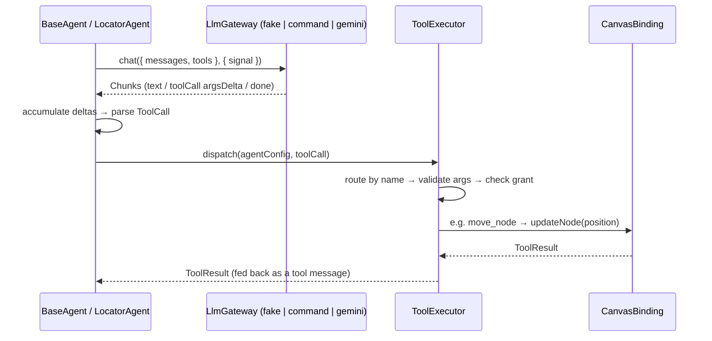

# LlmGateway — Shared Contract and Providers

## 1. Summary

The LLM access layer is now one shared contract, reconciled between the gateway work
and the locator-agent design: `LlmGateway.chat()` — provider-neutral chat messages and
tool definitions in, an async stream of `Chunk`s (text deltas, tool-call arg deltas, a
final `done`) out. `BaseAgent`/`LocatorAgent` and the `ToolExecutor` consume exactly this
contract; the fake gateway proves the tool-call path deterministically; Gemini 2.5 Flash
is the first HTTP provider behind it, text-only for now.

The former `LlmGatewaySupportable.complete()` interface is retired — one contract,
no duplicate surface.

## 2. The shared contract

```ts
interface LlmGateway {
    /** Optional capability metadata; absent means unspecified — do not assume tool support. */
    readonly capabilities?: LlmGatewayCapabilities; // { toolCalls: boolean }
    chat(req: ChatRequest, opts?: { signal?: AbortSignal }): AsyncIterable<Chunk>;
}

interface ChatRequest {
    messages: ChatMessage[]; // roles: system | user | assistant | tool
    tools: ToolDef[]; // JSON-Schema parameters + required capability
    stream?: boolean;
}

interface Chunk {
    text?: string;
    toolCall?: { id: string; name: string; argsDelta: string };
    done?: boolean;
    usage?: { inputTokens?: number; outputTokens?: number }; // on the done chunk when reported
}
```

Capability metadata answers "can this gateway/model emit tool calls?" before a request is
built: the fake gateway declares `{ toolCalls: true }`, Gemini declares
`{ toolCalls: false }` and rejects requests carrying tool definitions or tool messages.

## 3. How a tool call flows



Verified deterministically (no real provider): a scripted fake-gateway response carrying
`move_node { nodeId, by: { dx: 10, dy: 0 } }` flows through the executor and moves the
text-input node 10px right — the meeting's verification case — and the same call is
denied when the agent lacks the `canModifyCanvas` grant. The current canvas tool set is
`list_nodes` + `move_node`; property/name/color tools are a later slice.

## 4. Implementations

| Gateway                           | Where                            | Tool calls           | Notes                                                                      |
| --------------------------------- | -------------------------------- | -------------------- | -------------------------------------------------------------------------- |
| `createFakeGateway`               | `libs/agent/src/llm/fakeGateway` | yes (scripted)       | Deterministic test double; backs the agent/executor suites.                |
| `createCommandLlmGateway`         | `apps/web` (Lucas)               | yes (parsed command) | Offline dev gateway — no network, no key; drives the panel today.          |
| `createGeminiLlmGateway`          | `libs/agent/src/llm`             | **no** (text-only)   | First HTTP provider; see §5.                                               |
| `createGenerateApiSyncLlmGateway` | `apps/web` (Leon)                | **no** (text-only)   | eureka-flows-api adapter, non-WebSocket path (P0); see §6.1. Not wired in. |
| `createGenerateApiLlmGateway`     | `apps/web` (Leon)                | **no** (text-only)   | eureka-flows-api adapter, WebSocket/SLS path; see §6.2. Not wired in.      |

## 5. Gemini provider (text-only)

- Implements `chat()` over the **HttpRequest port** — never global `fetch`; a backend
  proxy becomes a `baseUrl` override or another port implementation, with no gateway change.
- Auth via the `x-goog-api-key` **header** — never in the URL; the key appears in neither
  error messages (error bodies are key-redacted before throwing) nor traces (trace
  redaction also guards secret-looking fields). Test-verified.
- Uses the Agent Environment for tracing and time; cancellation flows through the
  request's `AbortSignal`.
- System messages map to `systemInstruction`; assistant turns to the `model` role.
- The provider call is not streamed: the response is yielded as one text chunk, then a
  `done` chunk carrying usage tokens.
- `capabilities.toolCalls = false`; requests with tool definitions or tool messages are
  rejected loudly. Gemini tool calling is not implemented and not claimed.

## 6. Generate API gateways (eureka-flows-api adapter, item 7)

There are now **two** Generate API gateways, split by transport per the 07/21 meeting's P0
item ("adapt with eureka-flows-api: 1st) without web-socket (ai.model.generate), 2nd) using
web-socket (sls)"). Both post the same request body (shared via
`apps/web/.../utils/generateApiRequest.ts`) to `POST /runs/0/generate`, both implement the
shared `chat()` contract, and both are **text-only** (`capabilities.toolCalls = false`;
requests carrying tool definitions or tool messages are rejected, same as Gemini). They
differ only in how the answer comes back:

- **§6.1 `createGenerateApiSyncLlmGateway`** — no `connection`/`transport` params; the
  answer comes back inline in the HTTP response. This is the P0 gateway, real-API verified.
- **§6.2 `createGenerateApiLlmGateway`** — `transport=1` + a WebSocket-delivered result via
  a `GenerateReceiver`; the WS/SLS follow-up. Unchanged by the P0 work; still blocked on a
  real socket receiver (see §7).

### 6.1 Non-WebSocket / sync gateway (P0 — verified)

`createGenerateApiSyncLlmGateway` (`apps/web/src/app/features/flows/utils/`) is the direct,
synchronous Generate API path: one `POST /runs/0/generate` with **no** `connection` or
`transport` param, whose response carries the final model answer inline. No socket, no
`connectionId`, no `GenerateReceiver` — this gateway has no connection/readiness concept at
all, unlike §6.2.

**What Phase 0 real-API testing established** (against the actual dev backend, `flw-d1`,
via an authenticated browser session — a scripted sentinel-token prompt, run with no params
at all and again with `transport=0` explicitly):

- The HTTP `POST /runs/0/generate` returns **200**, and **blocks until the model finishes**
  (observed 2.7s–7.2s), rather than ACKing immediately.
- The response **is** the model's answer: `output.content` (string) and a `text` field both
  carry it directly — verified via a sentinel token (`EUREKA_SYNC_OK_...`) that round-tripped
  through `output.content`, `text`, and the raw Gemini `candidate.content.parts[0].text`.
- No async-ACK envelope: `StatusCode` and `$metadata` (present in the §6.2 WS smoke test)
  are both **absent** here.
- `usage` is populated with real, non-deterministic token counts; the response also carries
  richer fields not needed by the `Chunk` contract (`cost`, `candidate`, `version`, `$run`).
- **Omitting `transport` and explicitly setting `transport=0` produced identical results** —
  the gateway therefore sends neither; there is nothing for it to toggle.

Implementation:

- Request mapping is identical to §6.2 and shared via `generateApiRequest.ts`: system
  messages join with `\n\n` into `system`; a single user message becomes a plain string
  `prompt`; multi-turn user/assistant messages become `prompt.content` as `GenerateContent[]`
  (assistant → `model` role); `generation.temperature` → `config.temperature`.
- Response mapping: `output.content` (string) → text chunk, preferring it over the `text`
  field; if `output.content` is missing, falls back to `text`; a non-string `output.content`
  (image) throws a text-only error, same as §6.2. `usage.promptToken`/`inputTokenCount` →
  `inputTokens`; `usage.completionToken`/`outputTokenCount` → `outputTokens` (falls back to
  the top-level count fields since some responses carry usage only that way).
- `AbortSignal` passed straight through to `post`; throws `AbortError` if aborted by the
  time the response resolves.
- **Tested with a fake `post` only** (20 cases: capabilities, request mapping, transport
  params' absence, abort, response mapping incl. both fallbacks, tool rejection). The real
  backend was hit exactly once, manually, to establish the facts above — not through this
  gateway's code path, and not repeated in the test suite.
- **Not wired into `FlowEditorPage`/`AgentPanel` yet** — same standalone relationship
  `createCommandLlmGateway` has to the panel before being swapped in. Tool calling remains
  unimplemented and unclaimed; this is still a text-only gateway.

### 6.2 WebSocket/SLS gateway

`createGenerateApiLlmGateway` (`apps/web/src/app/features/flows/utils/`) is the
WebSocket-delivered Generate API path, per Claire's Generate API spec — unchanged by the P0
work above. It shares request mapping with §6.1 via `generateApiRequest.ts` but keeps its
own `GenerateConnectionSnapshot`/`GenerateReceiver` machinery, since it depends on a receiver
that doesn't exist yet (see §7).

**What real-API smoke testing established** (against the actual dev backend, `flw-d1` /
`wss-d1`, `connection` param fresh and matching the live socket, `transport=1` set):

- The HTTP `POST /runs/0/generate` ACKs with **200**.
- The ACK body is **not** the model's answer: inner `StatusCode: 202` (async acceptance),
  empty `text`/`output.content`, an AWS-SDK-shaped `$metadata`, and a `$run` record with
  run-lifecycle fields (`creditState`, `processType`, `finishedAt`, `executedAt`).
- **No `json:manifest` / `json:chunk` / `json:complete` WS frames were observed** within
  ~15s of the ACK, on a socket confirmed to receive raw frames (ping/pong) throughout.

Given that, this gateway **does not** implement an inline-body fallback — the inline body
is demonstrably not the model's answer, and treating it as one would silently return
run-acceptance metadata to callers. Instead:

- The gateway depends on a small local `GenerateReceiver<T>` interface
  (`wait(connectionId, fire): Promise<T>`) — a structural stand-in for whatever the real
  socket-layer receiver turns out to be (e.g. `ProxyTransportReceiver`). **No such receiver
  exists in `libs/socket` yet**; wiring one in, and injecting it via `getConnection()`, is
  the real socket work this gateway is waiting on.
- Readiness is guarded hard: `chat()` throws a clear error if the socket isn't connected,
  if `connectionId` is missing, or if no `generateReceiver` is available — read fresh on
  every call (never cached), per the spec's "use the latest `connectionId` after reconnect"
  rule.
- Request mapping: system messages join with `\n\n` into `system`; a single user message
  becomes a plain string `prompt`; multi-turn user/assistant messages become
  `prompt.content` as `GenerateContent[]` (assistant → `model` role). Response mapping:
  `output.content` (string) → one text chunk, then `done` with `usage.promptToken` →
  `inputTokens` / `completionToken` → `outputTokens`; a non-string `output.content` (image)
  throws a text-only error.
- **Tested with fakes only** — a scripted `GenerateReceiver` and a spied `post` function.
  No real backend call is made in tests, and none has been made through this gateway code
  path (only through the throwaway smoke-test hooks used to gather the facts above).
- **Not wired into `FlowEditorPage`/`AgentPanel` yet** — it exists as a standalone,
  fully-tested adapter, the same relationship `createCommandLlmGateway` has to the panel
  before it's swapped in.

**Do not claim this adapter is live end-to-end.** It is verified: (a) against the real
Generate HTTP endpoint at the smoke-test level (ACK/environment/params), and (b) against
fakes at the gateway-contract level. It has **not** been verified to deliver an actual
model answer, because no real receiver exists yet to prove that leg.

**This path is now confirmed backend/contract blocked** — a follow-up pass tested 8 query
param variants (both connection identifiers, both param names, a channel param, and
alternative `transport` values) against the real backend while watching raw WS frames, and
no Generate result frame was ever emitted. See
[`websocket-generate-verification.md`](./websocket-generate-verification.md) for the full
matrix and the open questions for Claire. Do not implement a `GenerateReceiver` until those
are answered.

## 7. Future providers and the proxy backend (TODO)

- **Provider targets behind the same contract:** OpenAI (GPT), Claude, OpenRouter,
  DeepSeek, GLM, Qwen. None are implemented yet.
- **Proxy backend:** OpenAI (and likely others) cannot be called reliably from the
  browser due to CORS and key-security constraints. Direction: a backend proxy —
  adapting **eureka-flows-api** together with Claire — reached through the same
  HttpRequest port. Not built yet; deliberately deferred until a provider that requires
  it is scheduled.
- **Generate WebSocket receiver:** the real socket-layer receiver (`libs/socket`) that
  would reassemble result frames into a `GenerateResponse` does not exist yet — and cannot
  be written until the backend confirms whether/what it emits. Verified backend-blocked;
  see §6.2 and [`websocket-generate-verification.md`](./websocket-generate-verification.md).
  (The `json:manifest`/`json:chunk`/`json:complete` frame names were always speculative and
  have never been observed.) §6.1's sync gateway has no such blocker.
- **Capability backfill:** the app's `createCommandLlmGateway` does not declare
  `capabilities` yet (the field is optional for compatibility); worth adding when touched.

## 8. Verification status (honest scope)

- Unit + integration tests: **133 passing** in `libs/agent` (environment, storage
  contract, http port, gemini gateway, self-check, canvas tools, executor, locator/base
  agent, fake-gateway→executor) and **131 passing** in `apps/web` (includes both Generate
  API gateways' fake-only suites and the real-browser Environment verification tests).
- Typecheck, `nx build agent`, and `nx build web` pass on this branch.
- **No live provider call has been made** through gateway code — Gemini and both Generate
  API gateways are verified against scripted/fake responses only. The real-API facts in
  §6.1 and §6.2 came from manual calls (a browser-console `fetch()` for §6.1, throwaway
  dev-only hooks for §6.2) made outside either gateway's actual code path.
- **No full editor E2E has been run.** The Environment self-check
  (`runAgentEnvironmentSelfCheck`) remains callable in the browser as a smoke check for
  localStorage and trace; `/dev/agent-harness` covers a manual real-browser Environment
  verification (fake LLM, not Generate API); a real editor/E2E pass is a follow-up step.
