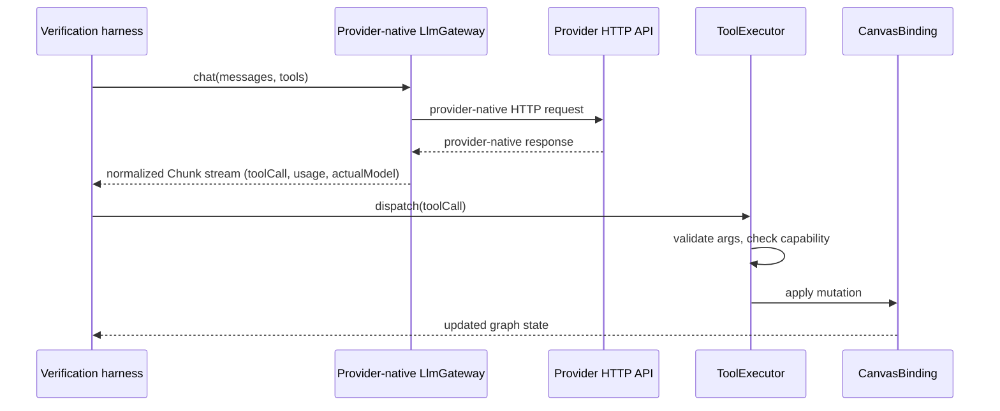

# Structured LLM Tool-Calling Integration Handoff

## 1. Purpose and Scope

This document covers the work required to support structured LLM tool calls —
a model emitting a machine-readable call such as `move_node` rather than free
text — across the following layers:

- the browser WebView (the flow editor UI);
- the in-browser agent layer (`libs/agent`);
- Eureka backend services (`eureka-flows-api`);
- provider SDKs (OpenAI, Gemini, Anthropic, OpenRouter);
- `ToolExecutor`, the single authority for turning a structured tool call into a
  canvas mutation;
- the canvas itself, via `CanvasBinding`.

The intended production flow is:

```
WebView
  → WebSocket JSON transport
  → backend service
  → Gemini/OpenAI SDK
  → normalized structured tool call
  → WebView ToolExecutor
  → canvas mutation
```

**What this branch covers:** the agent-layer contract (`LlmGateway`, `Chunk`,
`UsageInfo`), provider-native gateways that implement that contract directly
against each provider's own HTTP API, the tool-execution path from a normalized
tool call to a canvas mutation, a provider/model registry and benchmark
manifest, a real-provider verification harness with monitoring/reporting output,
and a browser-side Eureka gateway implementation with contract-level tests.

**What this branch does not cover:** the WebSocket JSON transport described in
the target flow above, any backend service that invokes a provider SDK on the
browser's behalf, a deployed tool-calling endpoint, and a completed browser
production end-to-end (E2E) path. These remain open work, described in
Section 7 and Section 9.

## 2. Executive Summary

- **Implemented:** a shared `LlmGateway` contract; three provider-native
  gateways (OpenAI, Gemini, Anthropic) that map that contract onto each
  provider's own tool-calling wire format; a config-driven provider/model
  registry and benchmark manifest; a real-provider verification harness driving
  11 fixed scenarios through the real `ToolExecutor` and a real in-memory
  `CanvasBinding`; monitoring/reporting utilities producing Markdown, JSON, CSV,
  JSONL, and a run manifest; a browser-side gateway
  (`createEurekaToolCallLlmGateway`) that calls a single, not-yet-deployed
  backend endpoint and is contract-tested against a real local HTTP server.
- **Verified with real providers:** the generated benchmark artifacts (Section
  12) record a full-matrix live run (generated `2026-08-04T06:27:03.070Z`)
  covering all 16 requested OpenAI/Gemini/OpenRouter configurations across all
  11 scenarios, producing 20 actual-model chart points (15 fixed configurations
  plus 5 distinct underlying models the `openrouter/free` route resolved to).
  `libs/agent/src/llm/providerRegistry.ts`'s own `realVerifiedModels` field has
  not been updated to reflect this run and still lists only an older, narrower
  subset (`gpt-4o-mini`, `gemini-2.5-flash`, `openrouter/free`) — see Section 5
  for how to read the generated artifacts as the current evidence instead of
  that field.
- **Prototype or draft:** the browser-side Eureka tool-calling gateway and its
  backend contract are implemented and tested against a scripted HTTP boundary,
  but the backend endpoint they target does not exist yet; the production
  browser E2E test is an explicit, always-skipped placeholder.
- **Primary backend work still required:** a deployed, tool-capable backend
  endpoint (or an extension of the existing Generate endpoint) that owns
  provider credentials, invokes a provider SDK server-side, and returns a
  normalized structured tool call to the browser — see Section 6 through
  Section 9.
- **Why this branch is a useful foundation:** the normalized data contract
  (`Chunk`, `UsageInfo`), the tool-execution path (`ToolExecutor`,
  `CanvasBinding`), and the verification/monitoring machinery are already built,
  tested offline, and — for a subset of models — verified against real
  provider APIs. Backend implementation work can target this same contract
  directly instead of designing one from scratch.

## 3. Current Architecture

### Components and responsibilities

| Component | File | Responsibility |
|---|---|---|
| `LlmGateway` | `libs/agent/src/llm/llmGateway.ts` | Provider-neutral contract: `chat(request): AsyncIterable<Chunk>`, plus a `capabilities.toolCalls` flag. |
| Provider-native gateways | `libs/agent/src/llm/OpenAiLlmGateway.ts`, `GeminiToolLlmGateway.ts`, `AnthropicToolLlmGateway.ts` | Map `LlmGateway` onto each provider's own tool-calling wire format; parse provider responses back into `Chunk`. |
| Text-only gateway | `libs/agent/src/llm/GeminiLlmGateway.ts` | Pre-existing, text-only Gemini gateway; declares `capabilities.toolCalls = false`; unrelated to tool-calling work except as a contrast case. |
| `BaseAgent` | `libs/agent/src/agents/baseAgent.ts` | Drains a `Chunk` stream, accumulates `toolCall` deltas by id into a completed call, and hands it to `ToolExecutor`. |
| `ToolExecutor` | `libs/agent/src/tools/toolExecutor.ts` | Sole mutation authority: name allowlist, JSON-Schema argument validation, capability gate, dispatch. Never throws. |
| `CanvasBinding` | `libs/agent/src/canvas/canvasBinding.ts` (interface), `engineCanvasBinding.ts` (real engine), `inMemoryCanvasBinding.ts` (tests) | The single write seam between agent/tool code and the canvas graph. |
| Provider registry | `libs/agent/src/llm/providerRegistry.ts` | Per-provider gateway type, model list, API-key env var, offline/real-key verification status. |
| Model manifest | `libs/agent/src/llm/modelManifest.ts` | Per-model benchmark metadata built on top of the registry: discovery source, fixed-vs-dynamic-route classification, stable-vs-preview. |
| Browser Eureka gateway | `apps/web/src/app/features/flows/utils/createEurekaToolCallLlmGateway.ts` | Browser-side `LlmGateway` implementation that calls a single Eureka backend endpoint; contract-tested, not backend-verified. |
| Existing Generate gateway | `apps/web/src/app/features/flows/utils/createGenerateApiLlmGateway.ts` | Existing, text-only integration with `eureka-flows-api`'s Generate endpoint, delivered over the flow WebSocket. Unaffected by this work. |
| Proposed backend contract | `docs/browser-agent/foundations/eureka-tool-calling-endpoint-contract.md` | A written proposal for a tool-capable backend endpoint. **Not implemented server-side.** |
| `eureka-flows-api` | Existing backend service (referenced as `@lemoncloud/eureka-flows-api` elsewhere in this repository) | Owns the existing Generate endpoint (Section 6) and, per the proposed contract, would own the tool-capable endpoint this work targets. |
| `eureka-agents-api` | A separate backend service package (referenced as `@lemoncloud/eureka-agents-api` elsewhere in this repository, e.g. `libs/engine/README.md`) | Distinct from `eureka-flows-api`. This repository does not document what it currently owns with respect to tool-calling; see the boundary note below. |

**Backend-service boundary — unresolved.** This repository references two
distinct backend service packages, `eureka-flows-api` and `eureka-agents-api`.
Which of the two would own the proposed tool-calling endpoint — including
`GenAIRequest`/`GenAIResponse` schema ownership, the WebSocket JSON transport,
the provider SDK invocation, tool-call normalization, and forwarding the
normalized response back to the WebView — is not established anywhere in this
repository's documentation or code. Section 8 records this as an open
technical decision; do not assume either service owns this work by default.

### Sequence (implemented path only — provider-native verification, not the browser production path)



This diagram describes the **verification harness path**, which is implemented
and — for a subset of models — real-provider verified. It is not the browser
production path described in Section 1 and Section 7, which requires a backend
service in the loop and has not been implemented.

## 4. Implemented Work

### 4.1 Provider Tool-Calling Support

`OpenAiLlmGateway.ts`, `GeminiToolLlmGateway.ts`, and `AnthropicToolLlmGateway.ts`
each:

- map `ToolDef[]` into that provider's own tool-declaration format (OpenAI
  `tools`/`function`; Gemini `functionDeclarations` with uppercase JSON-Schema
  `type` values; Anthropic `tools`/`input_schema`);
- parse a provider tool-call response into the shared `Chunk.toolCall` shape
  (`{ id, name, argsDelta }`);
- declare `capabilities.toolCalls = true`;
- map a tool-result message back into the provider's own follow-up-turn format
  (multi-turn mapping is implemented and offline-tested; it has not been
  exercised against a live multi-turn conversation — see Section 5).

Provider-specific differences are documented inline in each gateway file and in
`docs/browser-agent/foundations/provider-tool-calling.md` §2, including
Gemini's lack of a call-id concept (correlated by function name instead) and
Anthropic's distinct auth-header/response-shape requirements.

### 4.2 Agent and Tool Execution

`BaseAgent.collect()` (`libs/agent/src/agents/baseAgent.ts`) drains a `Chunk`
stream and accumulates `toolCall.argsDelta` fragments by `id` into one
completed call per id. `BaseAgent` then calls
`this.executor.dispatch(config, call, userPermissions)`.

`ToolExecutor.dispatch()` (`libs/agent/src/tools/toolExecutor.ts`):

1. looks up the tool by name — an unknown name returns a failed `ToolResult`,
   never a throw;
2. validates arguments against the tool's JSON Schema
   (`libs/agent/src/tools/validateArgs.ts`);
3. checks the tool's required capability against both the agent's fixed grant
   and the calling user's permission ceiling;
4. dispatches to the matching `ToolProvider` and catches any thrown error into
   a failed `ToolResult`.

`CanvasBinding` is the only write path a tool provider uses. The real
implementation (`engineCanvasBinding.ts`) wraps the live flow engine; the
in-memory implementation (`inMemoryCanvasBinding.ts`) is used by tests and the
verification harness to assert exact post-call node positions.

### 4.3 Provider Registry and Model Manifest

`libs/agent/src/llm/providerRegistry.ts` defines `PROVIDER_REGISTRY`, one entry
per provider, each with: `gatewayType`, `models: string[]`, `defaultModel`,
`apiKeyEnv`, an optional `modelEnvOverride` (a `<PROVIDER>_TEST_MODEL` variable
that narrows a run to one model), `status` (`'implemented' | 'planned' |
'blocked'`), `offlineVerified`, and `realVerifiedModels` — a subset of `models`
confirmed against a live key. These three fields are deliberately kept
separate so an offline-tested gateway is never conflated with a
real-key-verified one.

`OPENROUTER_ENTRY.dynamicRouteModels` marks `openrouter/free` specifically as a
**route**, not a fixed model — it may serve a different underlying model per
call, reported via `Chunk.actualModel`. Requested model (`record.model`) and
actual model (`record.actualModel`) are tracked as two separate fields
throughout the metrics/reporting layer; they are never merged.

`libs/agent/src/llm/modelManifest.ts` builds a per-model benchmark view on top
of the registry: discovery source and timestamp for each model id (the
provider's own docs, or the OpenRouter public Models API), a
`kind: 'fixed' | 'dynamic-route'` classification, and a `stable` flag for
preview/experimental model ids.

As registered today: OpenAI has 4 fixed models, Gemini has 5, OpenRouter has 6
fixed models plus the `openrouter/free` dynamic route (7 registry entries, 6
fixed + 1 route). DeepSeek, Qwen, Anthropic, and GLM are also registered
(`status: 'planned'`, offline-wired only) but are not part of the
OpenAI/Gemini/OpenRouter benchmark-breadth target. These counts are read
directly from `PROVIDER_REGISTRY`'s `models` arrays and will change if the
registry is edited — treat this document's counts as a snapshot, not a
guarantee, and re-check the registry directly.

### 4.4 Verification and Monitoring

`libs/agent/src/__tests__/llm/realLocatorScenarios.spec.ts` is a
registry-driven, env-gated real-provider test suite. For each
`(provider, model)` pair it runs all 11 scenarios from
`libs/agent/src/llm/verifyLocatorScenarios.ts`'s `LOCATOR_SCENARIOS`
(list/inspect, four directional moves, an absolute move, a selective
multi-node move, an ambiguous-target refusal, an unsupported-action refusal, a
no-op confirmation, and an unknown-target case) against the real
`ToolExecutor` and a real in-memory `CanvasBinding`, and asserts on the
resulting canvas state.

Each attempt is recorded (`VerificationRunRecord`,
`libs/agent/src/llm/verificationMetrics.ts`) with: provider, requested model,
actual model (when reported), scenario id, tool-call name, argument validity,
dispatch result, an outcome classification, elapsed time (measured at the call
site so a timeout is never silently dropped), input/output/cached/reasoning/
tool-use/provider-total token buckets, provider-reported or locally estimated
cost, retry count (currently always `0` — no retry logic exists in this
harness), and a sanitized error category (populated for Gemini failures only;
see `classifyRealProviderResult.ts`).

Outcome classification (`RealProviderOutcome`): `pass`, `known-variance` (an
empirically observed, narrowly defined alternate behavior — e.g. a model
looking up a node before acting on it — accepted for reporting purposes but
never a relaxed scoring criterion), `fail`, `timeout`, `provider-error`.
`pass` and `known-variance` together are "accepted"
(`isAcceptedOutcome`); the other three are not.

`buildElapsedVsTokensChart` (in `verificationMetrics.ts`) produces:
`mermaidSource` (canonical Mermaid `quadrantChart` text), `svg` (a rendered
chart built directly from the same underlying point data, not by parsing the
Mermaid text), and `tableMarkdown` (a companion table with an opaque `M01`,
`M02`, ... point id per row, mapped to the exact provider/requested/actual
model). Every plotted point corresponds to one `(provider, requestedModel,
actualModel)` group; a dynamic route that resolves to more than one actual
model produces one point per actual model, so the number of plotted points can
exceed the number of requested `(provider, model)` configurations.

Output formats: `formatMetricsMarkdownTable`, `formatCostRanking`,
`formatTokenDiagnosticsTable`, `formatVerificationRecordsCsv`,
`formatVerificationRecordsJsonl` — see Section 12 for the artifact files these
populate.

### 4.5 Browser-Side Integration Groundwork

`apps/web/src/app/features/flows/utils/createEurekaToolCallLlmGateway.ts`
implements the shared `LlmGateway` contract in the browser. It sends a single
HTTP request (via `@flows/web-core`'s existing `api.post`, which supplies the
session `x-api-key` header) to a configurable endpoint path (default
`/llm/tool-calls`) and validates the response structurally before trusting it.
It never accepts a provider API key, arbitrary base URL, or arbitrary
authorization header.

It is wired into `FlowAgentPanel.tsx`, but only behind the
`VITE_EUREKA_TOOL_CALL_ENDPOINT` build-time flag, which is unset by default —
selecting the default (unset) path falls back to the existing, text-only
`createGenerateApiLlmGateway`.

`createEurekaToolCallLlmGateway.contract.spec.ts` tests this gateway against a
real local HTTP server (not `FakeGateway`, not a mocked network layer),
covering request serialization, header/secret absence, response validation,
error mapping, cancellation, and a dispatch through the real `ToolExecutor` to
a real canvas mutation.

**Status: prototype / contract-tested. Not production-integrated.** The
backend endpoint it targets does not exist. `VITE_EUREKA_TOOL_CALL_ENDPOINT`
must remain unset in any deployed environment until that endpoint exists and
the acceptance criteria in the contract document (Section 24 of that document)
are met.

`browserToolCalling.production.e2e.spec.ts` (same directory) is an explicit,
always-`describe.skip` placeholder documenting the intended production E2E
path and its prerequisites (a browser-automation framework, which does not
exist in this repository, and a deployed backend endpoint). It contains no
passing assertions and must not be read as E2E coverage.

### 4.6 Documentation Added

| Document | Contents |
|---|---|
| `docs/browser-agent/foundations/provider-tool-calling.md` | Provider-native gateway wire mapping, `ToolExecutor` contract, the 11-scenario matrix, provider/model support table, usage/cost monitoring description, security notes on key handling, and known limitations. |
| `docs/browser-agent/foundations/eureka-tool-calling-endpoint-contract.md` | A proposed request/response/error schema, allowlists, size limits, timeout/retry/cancellation expectations, and a backend acceptance checklist for a tool-capable Eureka endpoint. Explicitly labeled as a proposal for an endpoint that does not exist. |
| `docs/browser-agent/foundations/production-readiness.md` | Current architecture, security boundary, model manifest summary, qualification policy, test-layer map, and known limitations, dated to a specific commit. |
| `docs/browser-agent/foundations/tool-calling-integration-handoff.md` | This document. |

## 5. Verification Evidence

As registered in `PROVIDER_REGISTRY`, the benchmark target across OpenAI,
Gemini, and OpenRouter is 16 requested configurations: 4 OpenAI models, 5
Gemini models, 6 fixed OpenRouter models, and the `openrouter/free` dynamic
route counted separately. Each configuration is run against the same 11
scenarios described in Section 4.4.

**Latest completed live benchmark.** The generated benchmark artifacts
(Section 12) record a full-matrix real-provider run generated at
`2026-08-04T06:27:03.070Z`, covering:

- all 16 requested OpenAI/Gemini/OpenRouter configurations;
- all 11 scenarios per configuration;
- 20 actual-model chart points in total — 15 from the fixed configurations plus
  5 distinct underlying models the `openrouter/free` route resolved to across
  its calls during that run, each given its own plotted point by
  `buildElapsedVsTokensChart` rather than being averaged together.

This evidence comes from the generated benchmark artifacts themselves
(`latest.md`, `latest.json`, `latest.csv`, `latest.jsonl`, `run-manifest.json`,
`elapsed-vs-tokens.mmd`, `elapsed-vs-tokens.svg` — see Section 12 for what each
contains), not from this document. This document summarizes that run; it does
not reproduce the full benchmark table. Consult the artifacts directly for
per-scenario outcomes, exact token/cost figures, and the complete provider ×
model × scenario breakdown.

**`providerRegistry.realVerifiedModels` is not the latest evidence.** Per the
registry's own `realVerifiedModels` field (checked directly in
`providerRegistry.ts`), the models it lists as having a recorded real-provider
run are: `gpt-4o-mini` (OpenAI), `gemini-2.5-flash` (Gemini), and the
`openrouter/free` route (OpenRouter). This is an older, narrower recorded
subset — it has not been updated to reflect the full 16-configuration,
20-point run described above. Do not treat `realVerifiedModels` as the
complete or current picture of what has been verified; treat the generated
benchmark artifacts as authoritative for the latest run, and treat
`realVerifiedModels` as a registry field that is out of sync with them pending
an update. All other registered models remain offline-verified only in the
sense that their gateway-level request/response mapping is tested against
scripted HTTP outside of what this latest run covered.

Each scenario attempt exercises the real `ToolExecutor` and a real in-memory
`CanvasBinding` — argument validation, capability gating, dispatch, and the
resulting node position are all checked against actual canvas state, not
mocked.

Clarifications that apply to every artifact this harness produces:

- **Real-provider qualification is not equivalent to browser production E2E.**
  This harness calls a provider directly, in a Node test environment, through
  the real `ToolExecutor`. It does not exercise the browser, a backend service,
  or WebSocket transport.
- **`openrouter/free` is a route, not one fixed model.** Its `requestedModel`
  is always `openrouter/free`; its `actualModel` varies by call and must be
  read from that field, never assumed.
- **Requested model and actual model are separate fields** everywhere in this
  codebase's records, CSV, JSON, and JSONL output — never merged into one
  label.
- **A partial cost or token value is marked, not hidden.** Aggregation
  functions flag an aggregate as incomplete rather than presenting a partial
  sum as a complete total, and never substitute a fabricated `0` for a value no
  scenario reported.

## 6. Existing Eureka Integration

The existing, pre-tool-calling integration path is `createGenerateApiLlmGateway`
(`apps/web/src/app/features/flows/utils/createGenerateApiLlmGateway.ts`),
which calls `eureka-flows-api`'s Generate endpoint and receives its result
over the flow's existing WebSocket/SLS delivery channel, not a synchronous
HTTP response body. It authenticates via the same session `x-api-key`
mechanism used elsewhere in the browser app; the backend, not the browser,
holds any provider credential.

Per `docs/browser-agent/foundations/provider-tool-calling.md` §1: the Generate
endpoint is documented there as accepting a `tools` field without erroring,
but not returning a structured tool call in any request shape tried during
that investigation. This document treats that as an existing, documented
finding, not a claim independently re-confirmed while writing this handoff.

Stated plainly:

- The existing Generate path has been used for **text generation**; it is not
  described anywhere in this repository as producing normalized structured
  tool calls.
- Structured tool-call support through the existing endpoint has **not been
  confirmed**.
- The draft endpoint in
  `docs/browser-agent/foundations/eureka-tool-calling-endpoint-contract.md` is
  a **proposal**. It is not a deployed backend endpoint, and no code in this
  repository calls it against a live server.

## 7. Proposed Production Flow

The following describes the intended architecture. It is not implemented as a
whole; per-step status follows each item.

1. The WebView sends a structured request through WebSocket JSON transport.
   **Not implemented.** The current browser gateway (`createEurekaToolCallLlmGateway`)
   uses a single synchronous HTTP POST, not the WebSocket transport described
   here.
2. The backend receives and correlates the request.
   **Not implemented.** No backend code for this exists in this repository.
3. The backend invokes the selected Gemini or OpenAI SDK.
   **Not implemented server-side.** Equivalent provider-native request
   construction exists client-side (Section 4.1) but has not been ported to,
   or reimplemented in, a backend service.
4. Provider-native tool-call output is normalized.
   **Implemented, client-side only**, as the shared `Chunk` shape (Section
   4.1). The normalization logic exists and is tested; whether the backend
   reuses this exact shape or its own is an open decision (Section 8).
5. The structured result is returned to the WebView.
   **Not implemented** for the WebSocket path. The current browser gateway
   receives its result as a synchronous HTTP response instead.
6. `ToolExecutor` validates and dispatches the tool call.
   **Implemented and verified** (Section 4.2) — this step does not depend on
   which transport delivers the tool call.
7. The canvas mutation is applied.
   **Implemented and verified** (Section 4.2/4.4).
8. Execution status and errors are reported.
   **Partially implemented.** The browser gateway maps HTTP/response errors to
   typed error classes (Section 4.5); no backend-side error reporting exists
   because no backend service exists yet.

## 8. Open Technical Decisions

The following are unresolved engineering questions, not assignments:

- **The service boundary between `eureka-flows-api` and `eureka-agents-api`
  remains to be confirmed**, specifically: which service owns
  `GenAIRequest`/`GenAIResponse`; which service terminates the WebSocket JSON
  transport; which service invokes the provider SDK; which service performs
  tool-call normalization; and which service forwards the normalized response
  back to the WebView. This repository does not establish an answer to any of
  these for either service.
- Whether to extend the existing Generate endpoint to support structured tool
  calls, or add a separate, dedicated tool-capable endpoint.
- The final `GenAIRequest`/`GenAIResponse` schema — the draft in
  `eureka-tool-calling-endpoint-contract.md` is a starting proposal, not a
  ratified contract.
- Responsibility boundaries between backend services more broadly (which
  service owns provider credentials, request correlation, and response
  normalization, beyond the `eureka-flows-api`/`eureka-agents-api` question
  above).
- Whether the backend response uses the same provider-neutral `Chunk` shape
  this repository already defines, or a different, backend-native structure
  the browser would need to translate.
- How a WebSocket request is correlated to its response (a request id, a
  socket-level sequence number, or another mechanism).
- Whether/how partial (streamed) tool-call output is delivered, versus a
  single complete response.
- The exact tool-call serialization format on the wire (JSON Schema
  passthrough, a normalized subset, or something else).
- The normalized error-response structure and its category vocabulary.
- Retry and timeout policy, and where it is enforced (backend, browser, or
  both).
- Authentication and authorization for the new endpoint — whether it reuses
  the existing session `x-api-key` mechanism unchanged.
- How usage, cost, and actual-model metadata are carried in the backend
  response, and whether they reuse the existing `UsageInfo` shape.
- Cancellation behavior when a user aborts a request mid-flight.
- Idempotency or duplicate-message handling for the WebSocket transport.
- How browser production E2E should be executed once a backend exists — which
  browser-automation framework, and in which environment.

## 9. Remaining Work

### P0 — Required for First Production Tool Call

- Confirm the service boundary between `eureka-flows-api` and
  `eureka-agents-api` for this work (Section 8) — which service owns the
  endpoint, the WebSocket transport, the provider SDK invocation, and response
  normalization.
- Finalize the backend contract (Section 8).
- Implement WebSocket JSON request transport for tool-calling requests.
- Invoke one supported provider SDK server-side.
- Normalize one `move_node` tool call to the shared/agreed response shape.
- Return it to the WebView.
- Execute it through the existing, unmodified `ToolExecutor`.
- Verify the resulting canvas mutation end to end.

### P1 — Reliability and Coverage

- Add correlation ids to the request/response cycle.
- Add normalized provider error categories on the backend response.
- Handle timeouts on the backend and/or browser side.
- Implement a retry policy, if the contract decision calls for one.
- Validate malformed tool arguments server-side, not only client-side.
- Add cancellation support end to end.
- Add structured logging (with secret redaction, matching this repository's
  existing convention).
- Add usage and actual-model metadata to the backend response.
- Expand provider coverage beyond the first supported provider.

### P2 — Production Qualification

- A complete browser-to-backend-to-provider E2E test, in a real browser
  automation framework (none currently configured in this repository).
- Authentication and authorization verification for the new endpoint.
- Failure-path testing (provider outage, malformed backend response, timeout).
- Load and concurrency testing.
- Production observability (metrics, alerting) for the new endpoint.
- A deployment and rollback procedure.

## 10. Important Files

| File | Responsibility | Current status | Notes for next implementer |
|---|---|---|---|
| `libs/agent/src/llm/llmGateway.ts` | Shared `LlmGateway`/`Chunk`/`UsageInfo` contract | Implemented | Backend response design should target this shape or a documented mapping to it. |
| `libs/agent/src/llm/providerRegistry.ts` | Per-provider gateway config and verification status | Implemented | `realVerifiedModels` is currently stale — it has not been updated to reflect the latest full-matrix live run (Section 5); treat the generated benchmark artifacts, not this field, as the current evidence, and update this field when reconciling the two. |
| `libs/agent/src/llm/modelManifest.ts` | Per-model benchmark metadata | Implemented | Derives from the registry; update the registry first, not this file directly, when adding a model. |
| `libs/agent/src/llm/OpenAiLlmGateway.ts` | OpenAI-compatible provider-native gateway (also serves OpenRouter, DeepSeek, Qwen, GLM via `baseUrl`) | Implemented, partially real-key verified | See Section 5 for which models. |
| `libs/agent/src/llm/GeminiToolLlmGateway.ts` | Gemini tool-capable gateway | Implemented, partially real-key verified | Distinct from the text-only `GeminiLlmGateway.ts`. |
| `libs/agent/src/llm/AnthropicToolLlmGateway.ts` | Anthropic tool-capable gateway | Implemented, offline-verified only | No recorded real-key run. |
| `libs/agent/src/agents/baseAgent.ts` | Tool-call accumulation and dispatch orchestration | Implemented | `collect()` is exported for direct testing of its id-merge behavior. |
| `libs/agent/src/tools/toolExecutor.ts` | Sole tool-dispatch authority | Implemented | Unmodified by this work; any backend integration must still route through this, not a new mutation path. |
| `libs/agent/src/tools/validateArgs.ts` | Hand-rolled JSON-Schema argument validator | Implemented | No schema-validation library (zod/ajv) is used anywhere in this repository. |
| `libs/agent/src/canvas/canvasBinding.ts` | `CanvasBinding` interface | Implemented | |
| `libs/agent/src/canvas/engineCanvasBinding.ts` | Real canvas binding over the live flow engine | Implemented | |
| `libs/agent/src/canvas/inMemoryCanvasBinding.ts` | In-memory canvas binding for tests/harness | Implemented | |
| `libs/agent/src/llm/verificationMetrics.ts` | Usage/cost capture, aggregation, chart and report formatting | Implemented | Exports `formatVerificationRecordsCsv`/`formatVerificationRecordsJsonl`; not yet wired into any runner other than `realLocatorScenarios.spec.ts`. |
| `libs/agent/src/llm/verifyLocatorScenarios.ts` | The 11-scenario matrix and its scoring logic | Implemented | `LOCATOR_SCENARIOS` is the canonical scenario list. |
| `libs/agent/src/llm/classifyRealProviderResult.ts` | Outcome and Gemini failure-category classification | Implemented | Gemini-specific fine-grained classifier only; no equivalent exists for other providers yet. |
| `libs/agent/src/__tests__/llm/realLocatorScenarios.spec.ts` | Real-provider, registry-driven verification runner | Implemented, env-gated | See Section 11 for exact run commands. |
| `libs/agent/src/__tests__/llm/realProviderToolCall.spec.ts` | Smaller, fixed-scenario real-provider check (OpenAI/Gemini only) | Implemented, env-gated | Complements, does not replace, `realLocatorScenarios.spec.ts`. |
| `apps/web/src/app/features/flows/utils/createEurekaToolCallLlmGateway.ts` | Browser-side Eureka tool-calling gateway | Prototype / contract-tested | Targets an endpoint that does not exist yet; feature-flagged off by default. |
| `apps/web/src/app/features/flows/utils/createEurekaToolCallLlmGateway.contract.spec.ts` | Contract test for the above, against a real local HTTP server | Implemented | Does not test the real backend, which does not exist. |
| `apps/web/src/app/features/flows/utils/browserToolCalling.production.e2e.spec.ts` | Production E2E placeholder | Explicit placeholder, always skipped | Requires a browser-automation framework (not present) and a deployed backend before it can be implemented. |
| `apps/web/src/app/features/flows/utils/createGenerateApiLlmGateway.ts` | Existing, text-only Generate integration | Implemented, pre-dates this work | Default browser gateway; unaffected by this branch. |
| `apps/web/src/app/features/flows/components/FlowAgentPanel.tsx` | Browser composition root selecting the active gateway | Implemented | Selects `createEurekaToolCallLlmGateway` only when `VITE_EUREKA_TOOL_CALL_ENDPOINT` is set. |
| `docs/browser-agent/foundations/eureka-tool-calling-endpoint-contract.md` | Proposed backend contract | Proposal, not implemented server-side | Starting point for Section 8's open decisions. |
| `docs/browser-agent/foundations/production-readiness.md` | Current architecture/status snapshot | Implemented, dated | Cross-reference for qualification policy and test-layer definitions. |
| `docs/browser-agent/foundations/provider-tool-calling.md` | Provider-native gateway reference | Implemented | Describes the client-side mapping this backend work would need to mirror or reuse. |

## 11. How to Run Verification

All commands assume the repository root as the working directory.

**Guaranteed-offline full-suite run.** `npx nx test agent` by itself is **not**
guaranteed offline in every environment — see the `.env.local` warning below:
four spec files load a repository-root `.env.local` file automatically and
gate only on the resulting key being present, independent of
`RUN_LIVE_PROVIDER_TESTS`. If `.env.local` contains a real provider key,
running the plain, unrestricted `npx nx test agent` command can make real
network calls. Use the exclusion command below whenever the run must stay
guaranteed-offline:

```sh
npx nx test agent --skip-nx-cache -- \
  --exclude "**/integration.live.spec.ts" \
  --exclude "**/property.live.spec.ts" \
  --exclude "**/locator.live.spec.ts" \
  --exclude "**/headless-gemini.smoke.spec.ts"
```

**One-model OpenAI smoke verification (requires a real, authorized API key —
incurs provider usage):**

```sh
RUN_LIVE_PROVIDER_TESTS=1 OPENAI_API_KEY=<your-key> \
  LIVE_PROVIDER_FILTER=openai OPENAI_TEST_MODEL=gpt-4o-mini \
  npx nx test agent --skip-nx-cache -- realLocatorScenarios
```

**One-model Gemini smoke verification:**

```sh
RUN_LIVE_PROVIDER_TESTS=1 GEMINI_API_KEY=<your-key> \
  LIVE_PROVIDER_FILTER=gemini GEMINI_TEST_MODEL=gemini-2.5-flash \
  npx nx test agent --skip-nx-cache -- realLocatorScenarios
```

**One-model OpenRouter smoke verification:**

```sh
RUN_LIVE_PROVIDER_TESTS=1 OPENROUTER_API_KEY=<your-key> \
  LIVE_PROVIDER_FILTER=openrouter OPENROUTER_TEST_MODEL=openai/gpt-4o-mini \
  npx nx test agent --skip-nx-cache -- realLocatorScenarios
```

**Complete configured matrix (every provider whose key is set; providers
without a key are skipped automatically):**

```sh
RUN_LIVE_PROVIDER_TESTS=1 \
  OPENAI_API_KEY=<your-key> GEMINI_API_KEY=<your-key> OPENROUTER_API_KEY=<your-key> \
  npx nx test agent --skip-nx-cache -- realLocatorScenarios
```

**Report output directory (optional, keeps artifacts outside the git working
tree):**

```sh
LIVE_METRICS_OUTPUT_DIR=/absolute/path/outside/repo \
  RUN_LIVE_PROVIDER_TESTS=1 OPENAI_API_KEY=<your-key> \
  npx nx test agent --skip-nx-cache -- realLocatorScenarios
```

Required environment variables for a live run:

- `RUN_LIVE_PROVIDER_TESTS=1` — explicit opt-in; without this, no live call is
  made even if a provider key is present.
- `LIVE_PROVIDER_FILTER` — optional, restricts a run to one `providerId`
  (`openai`, `gemini`, `openrouter`, `anthropic`, `deepseek`, `qwen`, `glm`).
- `<PROVIDER>_TEST_MODEL` (e.g. `OPENAI_TEST_MODEL`, `GEMINI_TEST_MODEL`,
  `OPENROUTER_TEST_MODEL`) — optional, restricts a run to one model instead of
  every model registered for that provider.
- `LIVE_METRICS_OUTPUT_DIR` — optional, overrides the default in-repository
  output directory.

**Warning:** any command above with `RUN_LIVE_PROVIDER_TESTS=1` and a real API
key makes real network calls and incurs real provider usage. Only run these
with an authorized, appropriately-scoped credential. Do not paste a real key
value into a shared terminal history or log.

**`.env.local` auto-loading risk:** `libs/agent/src/__tests__/harness/scenarios/integration.live.spec.ts`,
`property.live.spec.ts`, `locator.live.spec.ts`, and
`libs/agent/src/__tests__/headless-gemini.smoke.spec.ts` import a
`loadEnvLocal` helper that loads a repository-root `.env.local` file as an
import side effect and gate only on the resulting key being present — **not**
on `RUN_LIVE_PROVIDER_TESTS`. If such a file exists locally with a real key,
running the unrestricted full test suite will make real live calls through
these four files without requiring the opt-in variable this document otherwise
relies on. Use the exclusion command shown above for any run that must stay
guaranteed-offline, and treat bringing these four files onto the same explicit
opt-in gate as unfinished harness work, not something this branch has done.

## 12. Generated Artifacts

Written by `realLocatorScenarios.spec.ts`'s `afterAll` hook, to
`docs/browser-agent/verification-metrics/` by default (or
`LIVE_METRICS_OUTPUT_DIR`, if set), only when at least one scenario actually
ran this session:

| File | Purpose |
|---|---|
| `latest.md` | Human-readable report: aggregate table, cost ranking, token diagnostics, and the elapsed-vs-tokens chart section. |
| `latest.json` | Full report object: `generatedAt`, `costCurrency`, per-`(provider, model)` aggregates, and every individual scenario record. |
| `latest.csv` | One row per scenario attempt, exact/unsanitized identifiers. |
| `latest.jsonl` | One JSON object per line, one line per scenario attempt — suitable for streaming/append-style consumption. |
| `run-manifest.json` | Per-run metadata: opt-in state, provider filter, scenario count, which `(provider, model, scenario)` triples were attempted this session, and which prior sessions' data were merged in. |
| `elapsed-vs-tokens.mmd` | Canonical, editable Mermaid `quadrantChart` source for the elapsed-time-vs-tokens chart. |
| `elapsed-vs-tokens.svg` | A rendered SVG of the same chart, generated directly from the same underlying point data as the `.mmd` file (not by parsing it), so the two cannot diverge from each other. |

`latest.json`, `latest.csv`, and `latest.jsonl` preserve every provider,
requested-model, and actual-model identifier exactly as reported — these are
the raw-evidence files; treat `latest.md`'s prose as a summary of them, not the
other way around.

A prior version of the chart embedded raw Mermaid text inline inside
`latest.md`. That approach was found to be unreliable in at least one Mermaid
rendering environment, independent of the underlying data's correctness. The
current implementation renders a portable SVG directly from the same
coordinate data and embeds that image in `latest.md`, with `elapsed-vs-tokens.mmd`
kept as the separate, editable source — a rendered image is more broadly
compatible across viewers than an inline diagram fence, while the raw text
source remains available unmodified.

## 13. Known Limitations and Risks

- No confirmed browser production E2E exists; the corresponding test file is
  an explicit placeholder.
- No confirmed, deployed structured tool-call backend contract exists; the
  written contract is a proposal.
- Dynamic-routing behavior (`openrouter/free`) means a single requested
  configuration can resolve to a varying number of actual models across runs;
  reports must be read with this in mind rather than assuming a fixed
  point-per-configuration count.
- Token and cost totals can be partial for a given aggregate; partial totals
  are marked, not hidden, but must not be read as complete without checking
  the relevant flag.
- Provider model behavior is not fully deterministic; a documented
  "known-variance" outcome reflects an observed, accepted alternate behavior,
  not a guarantee that behavior will recur identically.
- Model availability and versions can change upstream of this repository;
  registry entries reflect a point-in-time snapshot with a recorded discovery
  source and timestamp.
- Live-test credentials require careful handling; commands in Section 11 make
  real network calls and must only be run with an authorized key.
- A repository-root `.env.local` file can cause some pre-existing live spec
  files to run automatically (Section 11); this is a real operational risk to
  be aware of, not a defect introduced by this branch.
- Mermaid rendering compatibility varies by viewer/extension; Section 12
  describes the current mitigation (a rendered SVG alongside the source).
- Backend responsibility boundaries (Section 8) remain undecided.

None of the above invalidates the verification work already completed and
described in Section 5; they define the boundary of what that work does and
does not establish.

## 14. Recommended Continuation Sequence

1. Review the draft contract
   (`eureka-tool-calling-endpoint-contract.md`) and the current Generate path
   (`createGenerateApiLlmGateway.ts`, Section 6).
2. Decide whether the existing Generate endpoint is extended or a new,
   dedicated endpoint is introduced (Section 8).
3. Agree on the normalized request/response schema for that endpoint.
4. Implement one server-side provider path (one provider, one SDK call).
5. Complete one full `move_node` round trip: WebView request → backend →
   provider → normalized tool call → `ToolExecutor` → canvas mutation.
6. Add a browser production E2E test once the above is deployed to a testable
   environment.
7. Expand provider coverage and add the reliability behavior listed in
   Section 9's P1.
8. Finalize monitoring and complete the production-qualification checklist in
   Section 9's P2.

## 15. Status Matrix

| Area | Status |
|---|---|
| Provider-native tool calling (OpenAI, Gemini, Anthropic gateways) | Complete (offline); Verified with real provider — full 16-configuration OpenAI/Gemini/OpenRouter matrix per the latest generated benchmark artifacts (Section 5); Anthropic remains offline-verified only |
| Normalized tool calls (`Chunk`, `UsageInfo`) | Complete |
| `ToolExecutor` dispatch | Complete |
| Canvas verification (in-memory + real engine binding) | Complete |
| Monitoring and reporting (metrics, CSV/JSONL/Markdown/chart) | Complete |
| Model benchmark (registry + manifest) | Complete |
| Browser adapter (`createEurekaToolCallLlmGateway`) | Prototype |
| Backend tool-call endpoint | Blocked by backend contract — not started server-side |
| WebSocket JSON transport for tool calls | Not started |
| Provider SDK execution server-side | Not started |
| Browser production E2E | Not started (explicit placeholder only) |
| Production readiness (overall) | Not production-ready |
